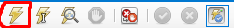
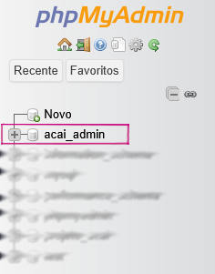
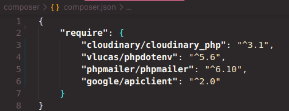

# Projeto Açaí e Polpas Amazônia
<h2>Projeto de um site conectado a um Banco de Dados <em>MySQL</em> utilizando <em>PHP</em> como ponte entre <em>FrontEnd</em> e <em>BackEnd</em></h2>
<h3>⬇️ Preview do Site</h3>

<a href="https://www.figma.com/design/KG2g0vrnxkWhpYED4uM7DG/Projeto-A%C3%A7a%C3%AD?node-id=0-1&p=f&t=wKqWymchvS68Lj0V-0">
    Projeto no <strong>Figma</strong>
</a>

Sistema de Gerenciamento de Vendas para Clientes de produtos selecionados, adicionados ao carrinho e confirmados

    Todas as imagens utilizadas na página web foram adicionadas à nuvem por meio do serviço 
    <a href="https://cloudinary.com/">Cloudinary</a>

<h3>🗄️ API</h3>

    - Inicialmente, projetada utilizando a linguagem <strong>PHP</strong> como ponte entre o <strong>Banco de Dados</strong>(BackEnd) e a <strong>Página Web</strong>(FrontEnd)

- Gerenciamento de Usuários, seus Pedidos e envio para uma Planilha das solicitações que forem Confirmados

- Possui soluções para usuários que tentarem acessar Páginas Específicas sem cadastro efetuado

- As sessões de cada usuário duram cerca de 1 hora. Após esse tempo, será necessário realizar novamente a identificação

- Para diferenciar cada usuário que utilizar o site, há um sistema de Cadastro/Login, incluindo: 

<ul>
    <li>Nome</li>
    <li>Email</li>
    <li>Telefone de Contato</li>
    <li>Endereço</li>
    <ul>
        <li>Rua</li>
        <li>Número da Residência</li>
        <li>Bairro</li>
        <li>Cidade</li>
        <li>Ponto de Referência</li>
    </ul>
    <li><strong>Senha</strong>*</li>
</ul>

- Email recebido de forma limpa (removendo caracteres indesejados)

    - 🔐 Senhas Criptografadas por meio da função <strong><em>password_hash()</em></strong> dentro do PHP e salvas no Banco de Dados já criptografadas

- 📱  Responsividade em dispositivos portáteis / menores

<h3>📂 Esquema de Pastas</h3>
    <pre>
        |
        |-- composer                                (Pasta Bibliotecas Utilizadas)
        |-- public                                  (Site Propriamente Dito)
        |   |
        |   |-- account                             (Página do Usuário)
        |   |-- cart                                (Página do Carrinho)
        |   |-- CSS                                 (Folhas de Estilo utilizadas nas páginas)
        |   |-- JS                                  (JavaScript utilizado nas páginas)
        |   |-- mannager                            (Página de Gerenciamento p/ Administradores)
        |   |-- products                            (Página de Produtos)
        |   |-- readMe-images                       (Imagens Utilizadas no README.md)
        |   |-- errorPage.php                       (Página de Erro Geral)
        |   |-- footerHeader.php                    (Código PHP para imprimir o cabeçalho e rodapé de cada página)
        |   |-- GeneralPHP.php                      (Códigos PHP utilizados em mais de uma página)
        |   |-- index.php                           (Página Inicial)
        |
        |-- dbConnection.php                        (Conectar o Banco de Dados com o FrontEnd)
        |-- dumpProjetoAcai.sql                     (Cópia do Banco de Dados utilizado)   
    </pre>

<h3>🖥️ Rodar o projeto</h3>
<ol>
    <li>
        🪟 Windows
        <ul>
            <li>Baixe o <a href="https://www.youtube.com/watch?v=0Y9OZ0vc1SU&t=213s">XAMPP</a></li>
            <li>Ative os módulos <strong>Apache</strong> e <strong>MySQL</strong> dentro do <strong>XAMPP</strong></li>
            <li>
                Baixe o <a href="https://www.youtube.com/watch?v=a5ul8o76Hqw&t=13s">MySQL WorkBench</a> ou outro aplicativo gerenciador de Banco de Dados
            </li>
            <li>Abra o arquivo "DumpProjetoAcai.sql", copie o código dentro dele e Clone o Banco de Dados dentro do MySQL (Dump)</li>
            <li>
                Adicione o Banco de Dados ao seu Servidor Local clicando no símbolo demonstrado abaixo   
                </img>
            </li>
            <li>
                Para verificar se o Banco de Dados foi realmente adicionado, digite no navegador <strong>"localhost/phpmyadmin"</strong>.  
                Se a relação <strong>"acai_admin"</strong> existir na aba esquerda da tela ➡️ Adicionado com Sucesso  
                </img>
            </li>
            <li>Adicione a Pasta do Projeto ao Diretório <strong>"htdocs"</strong> dentro de <strong>Xampp</strong> <pre>(C:\xampp\htdocs)</pre></li>
            <li>
                Abra o terminal na pasta Projeto_Acai2.0 e digite os seguintes comandos: <small>(instalar as dependências do composer)</small>
                <pre>cd composer</pre>
                <pre>composer install</pre>
                <pre>composer require cloudinary/cloudinary_php</pre>   <pre>composer require vlucas/phpdotenv</pre>
                <pre>composer require phpmailer/phpmailer</pre>         <pre>composer require google/apiclient:^2.0</pre>
                </img>
            </li>
            <li>Crie um <a href="https://www.youtube.com/watch?v=k_PB4ORz2r0">Projeto no Google Cloud</a></li>
            <li>Ative a API do Google Sheets</li>
            <li>Crie uma conta de serviço e baixe o 'credenciais.json'</li>
            <li>Compartilhe sua planilha com o e-mail da conta de serviço</li>
            <li>
                Substitua na linha 12 do arquivo Cart.php o link para setAuthConfig para o diretório em que o arquivo .json baixado anteriormente se encontra
            </li>
            <li>Substitua no linha 16 do arquivo Cart.php o link da planilha pela sua criada anteriormente</li>
            <li>
                Para acessar o site, Digite no Navegador <pre>http://localhost/Projeto_Acai2.0/public</pre>
            </li>
        </ul>
    </li>
    <li>
        🐧 Linux
        <ul>
            <li>Instale o <a href="https://youtu.be/Uuw4KPiVATc?si=8L49cPxz9CTX09NE&t=211">MySQL WorkBench</a> ou outro aplicativo gerenciador de Banco de Dados</li>
            <li>Instale o <a href="https://www.youtube.com/watch?v=XoKUkdmfTZQ">XAMPP</a></li>
            <li>Ative os módulos <strong>Apache Web Server</strong> e <strong>MySQL Database</strong> de 2 maneiras: </li>
                <ol>
                    <li>Ativando os módulos pelo terminal   <pre>sudo /opt/lampp/lampp start</pre></li>
                    <li>Ativando pela interface gráfica   <pre>cd /opt/lampp</pre> <pre>sudo ./manager-linux-x64.run</pre></li>
                </ol>
            <li>Abra o arquivo "DumpProjetoAcai.sql", copie o código dentro dele e Clone o Banco de Dados dentro do MySQL (Dump)</li>
            <li>
                Adicione o Banco de Dados ao seu Servidor Local clicando no símbolo demonstrado abaixo   
                </img>
            </li>
            <li>
                Para verificar se o Banco de Dados foi realmente adicionado, digite no navegador <strong>"localhost/phpmyadmin"</strong> ou <strong>"127.0.0.1/phpmyadmin"</strong>.  
                Se a relação <strong>"acai_admin"</strong> existir na aba esquerda da tela ➡️ Adicionado com Sucesso  
                </img>
            </li>
            <li>Adicione a Pasta do Projeto ao Diretório <strong>"htdocs"</strong> dentro de <strong>Xampp</strong> <pre>(/opt/lampp/htdocs)</pre></li>
            <li>
                Abra o terminal na pasta Projeto_Acai2.0 e digite os seguintes comandos: <small>(instalar as dependências do composer)</small>
                <pre>cd composer</pre>
                <pre>composer install</pre>
                <pre>composer require cloudinary/cloudinary_php</pre>   <pre>composer require vlucas/phpdotenv</pre>
                <pre>composer require phpmailer/phpmailer</pre>         <pre>composer require google/apiclient:^2.0</pre>
                </img>
            </li>
            <li>Crie um <a href="https://www.youtube.com/watch?v=k_PB4ORz2r0">Projeto no Google Cloud</a></li>
            <li>Ative a API do Google Sheets</li>
            <li>Crie uma conta de serviço e baixe o 'credenciais.json'</li>
            <li>Compartilhe sua planilha com o e-mail da conta de serviço</li>
            <li>
                Substitua na linha 12 do arquivo Cart.php o link para setAuthConfig para o diretório em que o arquivo .json baixado anteriormente se encontra
            </li>
            <li>Substitua no linha 16 do arquivo Cart.php o link da planilha pela sua criada anteriormente</li>
            <li>
                Para acessar o site, Digite no Navegador <pre>http://localhost/Projeto_Acai2.0/public</pre>
            </li>
        </ul>
    </li>

</ol>

<strong>
    
OBS: Os videos citados acima estão aqui apenas para facilitar a retirada de dúvidas em relação a como rodar o projeto

</strong>

<h3>📋 Para fazer: </h3>
<ul>
    <li>✅ Link Página de Produtos com Página do Carrinho </li>
    <li>✅ PHP Página do Carrinho + Link Planilha Excel/Google Planilhas (concluir Pedido)</li>
    <li>✅ Filtros na Página de Produtos</li>
    <li>✅ Pesquisas na Página de Produtos</li>
    <li>✅ Página de Mudança de Credenciais</li>
    <li>✅ Página especial para email</li>
    <li>✅ Página especial para Senha</li>
    <li>✅ Mudanças na Página de logout (enviar p/ pagina certa)</li>
    <li>✅ Página "Esqueceu a Senha"</li>
    <li>Verificação de Existencia de Email e Número de Telefone</li>
    <li>Página do Administrador</li>
    <li>API de Pagamentos</li>
</ul>
