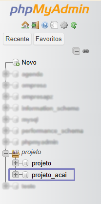
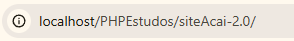

# Projeto Açaí Amazônia Ipatinga
<h2>Projeto de um site conectado a um Banco de Dados MySQL utilizando PHP como ponte</h2>
<h3>⬇️ Preview do Site</h3>

<a href="https://www.figma.com/design/KG2g0vrnxkWhpYED4uM7DG/Projeto-A%C3%A7a%C3%AD?node-id=0-1&p=f&t=wKqWymchvS68Lj0V-0">
    Projeto no <strong>Figma</strong>
</a>

Sistema de Gerenciamento de Vendas para Clientes de produtos selecionados, adicionados ao carrinho e confirmados

    Todas as imagens utilizadas na página web foram adicionadas à núvem por meio do serviço 
    <a href="https://cloudinary.com/">Cloudinary</a>

<h3>🗄️ API <small>(em desenvolvimento)</small></h3>

    - Inicialmente, projetada utilizando a linguagem <strong>PHP</strong> para conectar o <strong>Banco de Dados</strong>(BackEnd) com uma <strong>Página Web</strong>(FrontEnd)

Gerenciamento de Usuários, seus Pedidos e envio para uma Planilha desses pedidos que forem Confirmados

Para diferenciar cada usuário que utilizar o site, existe um sistema de Cadastro/Login com Captcha, incluindo: 

Possui soluções para usuários que tentarem acessar Páginas bloqueadas sem estarem cadastrados

<ul>
    <li>Nome</li>
    <li>Email</li>
    <li>Telefone de Contato</li>
    <li>Endereço</li>
    <ul>
        <li>Rua</li>
        <li>Número da Residência</li>
        <li>Bairro</li>
        <li>Cidade</li>
        <li>Bairro</li>
        <li>Ponto de Referência</li>
    </ul>
    <li><strong>Senha</strong>*</li>
</ul>

    🔐 Senhas Criptografadas por meio da função <strong><em>password_hash()</em></strong> dentro do PHP, salvas dentro do Banco de Dados já criptografadas

📱  Responsividade em dispositivos portáteis

<h3>📂 Esquema de Pastas</h3>
    <pre>
        |
        |-- account                             (Página do Usuário)
        |-- cart                                (Página do Carrinho)
        |-- products                            (Página de Produtos)
        |-- readMe-images                       (Imagens Utilizadas no ReadMe.md)
        |-- scripts                             (JavaScript utilizado nas páginas)
        |-- styles                              (Folhas de Estilo utilizadas nas páginas)
        |-- dbConnection.php                    (Conectar o Banco de Dados com o FrontEnd)
        |-- GeneralPHP.php                      (Códigos PHP utilizados em mais de uma página)
        |-- index.php                           (Página Inicial)
    </pre>

<h3>🖥️ Rodar o projeto</h3>
<ol>
    <li>Baixe o <a href="https://www.youtube.com/watch?v=0Y9OZ0vc1SU&t=213s">XAMPP</a></li>
    <li>Ative os módulos <strong>Apache</strong> e <strong>MySQL dentro do XAMPP</strong></li>
    <li>Baixe o <a href="https://www.youtube.com/watch?v=a5ul8o76Hqw&t=13s">MySQLWorkBench</a></li>
    <li>Abra o arquivo "DumpProjeto_acai.sql" e Clone o Banco de Dados (Dump)</li>
    <li>
        Adicione o Banco de Dados ao seu Servidor Local clicando no símbolo demonstrado abaixo   </img>
    </li>
    <li>
        Para verificar se o Banco de Dados foi realmente adicionado digite no navegador "localhost/phpmyadmin", se a relação "projeti_acai" existir
        na aba esquerda da tela o Banco de Dados foi adicionado com sucesso </img>
    </li>
    <li>Adicione a Pasta do projeto a pasta "htdocs" dentro de xampp (C:\xampp\htdocs)</li>
    <li>
        Digite no Navegador "http://localhost/PHPEstudos/siteAcai-2.0"</img>
    </li>
</ol>

<h3>📋 Para fazer: </h3>
<ul>
    <li>Terminar API</li>
</ul>