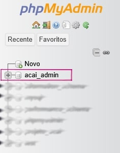
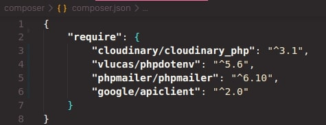
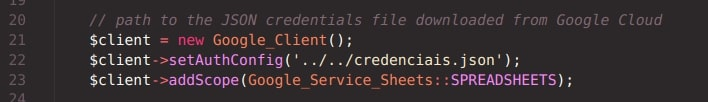

# Projeto Açaí e Polpas Amazônia
<h2>
    Projeto de um site conectado a um Banco de Dados <em>MySQL</em> utilizando <em>PHP</em> como ponte entre a <em>Página Web</em> e os <em>Dados</em>
</h2>
<h3>⬇️ Preview do Site</h3>
</img>
<a href="https://www.figma.com/design/KG2g0vrnxkWhpYED4uM7DG/Projeto-A%C3%A7a%C3%AD?node-id=0-1&p=f&t=wKqWymchvS68Lj0V-0">
    Projeto no <strong>Figma</strong>
</a>

    Todas as imagens utilizadas na página web estão armazenadas na Nuvem por meio do serviço 
    <a href="https://cloudinary.com/">Cloudinary</a>

<h3>🗄️ API</h3>

    - Inicialmente, projetada utilizando a linguagem <strong>PHP</strong> como ponte entre o <strong>Banco de Dados</strong>e a <strong>Página Web</strong>

- Gerenciamento de Usuários, seus Pedidos e envio para uma Planilha Online das solicitações que forem Confirmados

    <a href="https://docs.google.com/spreadsheets/d/1xJdM0OgynL5SKLoJ5gxH91abtQ18SY7Xp2dsMVkPvKk/edit?usp=sharing">Planilha</a>

- Usuários são diferenciados entre Clientes e Administradores

<ul>
    <li>Clientes: Possuem um Pedido ao iniciar uma sessão</li>
    <li>Administradore: Possuem Foto de Perfil e possibilidade de Alterar o Banco de Dados</li>
</ul>

- Possui soluções para usuários que tentarem acessar Páginas Específicas sem cadastro efetuado/ condiçãode acesso

- As sessões de cada usuário duram cerca de 1 hora. Após esse tempo, será necessário realizar novamente a identificação

- Para diferenciar cada usuário que utilizar o site, há um sistema de Cadastro/Login, incluindo: 

<ul>
    <li>Nome</li>
    <li>Email*</li>
    <li>Telefone de Contato</li>
    <li>Endereço</li>
    <ul>
        <li>Rua</li>
        <li>Número da Residência</li>
        <li>Bairro</li>
        <li>Cidade</li>
        <li>Estado</li>
        <li>Ponto de Referência</li>
    </ul>
    <li>Foto de Perfil**</li> 
    <li><strong>Senha</strong>***</li>
</ul>

* Email recebido de forma limpa (removendo caracteres indesejados) e com Verificação de Existência do Domínio

** Foto de Perfil apenas para Administradores

    *** Senhas Criptografadas por meio da função <strong><em>password_hash()</em></strong> dentro do PHP e salvas no Banco de Dados já criptografadas

    - Possui solução para <strong>Redefinir Senha</strong>: Enviar um email, por meio da biblioteca <strong>PHPmailer</strong>, com o código de confirmação para validar a alteração 

- Possíveis <strong>Ações</strong> que <strong>Administradores</strong> podem realizar: 

<ul>
    <li>Adicionar, Remover ou Alterar Dados de um Administradores</li>
    <li>Remover ou Alterar Dados de um Cliente</li>
    <li>Adicionar, Remover ou Editar Dados de um Produto</li>
    <li>Adicionar, Remover ou Editar Dados de uma Versão de um Produto</li>
    <li>Visualizar Pedidos</li>
    <li>Alterar seus próprios Dados Pessoais</li>
</ul>

    - Na Página de Produtos é possível <strong>filtrá-los</strong> por <strong>Nome</strong>(pesquisa, (A-Z), (Z-A)) e por <strong>Preço</strong>(crescente, decrescente)

- 📱 <strong>Responsividade</strong> em dispositivos portáteis / menores

    - <strong>OBS</strong>: Por questões de Segurança, as features de <strong>Alterar Imagens</strong> tanto de Produtos como de Administradores e <strong>Alterar a Planilha Online</strong> não estão funcionando, uma vez que a API do Cloudinary depende de uma chave privada para alterar as imagens

    - As duas features acima estarão disponíveis apenas se voce <strong>Criar suas Próprias Conexões</strong>, como será citado abaixo

<h3>📂 Esquema de Pastas</h3>
    <pre>
        |
        |-- composer                                (Pasta Bibliotecas Utilizadas)
        |-- public                                  (Site Propriamente Dito)
        |   |
        |   |-- account                             (Página do Usuário)
        |   |-- cart                                (Página do Carrinho)
        |   |-- CSS                                 (Folhas de Estilo utilizadas nas páginas)
        |   |-- JS                                  (JavaScript utilizado nas páginas)
        |   |-- mannager                            (Página de Gerenciamento p/ Administradores)
        |   |-- products                            (Página de Produtos)
        |   |-- readMe-images                       (Imagens Utilizadas no README.md)
        |   |-- errorPage.php                       (Página de Erro Geral)
        |   |-- footerHeader.php                    (Código PHP para imprimir o cabeçalho e rodapé de cada página)
        |   |-- GeneralPHP.php                      (Códigos PHP utilizados em mais de uma página)
        |   |-- index.php                           (Página Inicial)
        |
        |-- dbConnection.php                        (Conectar o Banco de Dados com a Página Web)
        |-- DumpProjetoAcai.sql                     (Cópia do Banco de Dados utilizado)   
    </pre>

<h3>🖥️ Rodar o Projeto</h3>
<ol>
    <li>
        🪟 Windows
        <ul>
            <li>Baixe o <a href="https://www.youtube.com/watch?v=0Y9OZ0vc1SU&t=213s">XAMPP</a> para abrir um Servidor Local</li>
            <li>
                Ative os módulos <strong>Apache</strong> e <strong>MySQL</strong> dentro do <strong>XAMPP</strong>
            </li>
            <li>
                Baixe e crie uma conexão no <a href="https://www.youtube.com/watch?v=a5ul8o76Hqw&t=13s">MySQL WorkBench</a> ou outro aplicativo gerenciador de Banco de Dados
            </li>
            <li>
                Abra o Arquivo <strong>"DumpProjetoAcai.sql"</strong> e copie o código dentro dele para um arquivo dentro da conexão
            </li>
            <li>
                Execute a sequência de código para <strong>Adicionar o Banco de Dados</strong> ao seu Servidor Local clicando no Símbolo Demonstrado abaixo   
                </img>
            </li>
            <li>
                Para verificar se o Banco de Dados foi realmente adicionado, digite no Navegador <strong>"localhost/phpmyadmin"</strong>.  
                Se a relação <strong>"acai_admin"</strong> existir na Aba Esquerda da tela ➡️ Adicionado com Sucesso  
                </img>
            </li>
            <li>
                Adicione a Pasta do Projeto ao Diretório <strong>"htdocs"</strong> dentro de <strong>Xampp</strong> <pre>(C:\xampp\htdocs)</pre>
            </li>
            <li>
                Abra o Terminal/CMD na pasta Projeto_Acai2.0 e digite os seguintes comandos: <small>(instalar as dependências do composer)</small>
                <pre>cd composer</pre>
                <pre>composer install</pre>
                <pre>composer require cloudinary/cloudinary_php</pre>   <pre>composer require vlucas/phpdotenv</pre>
                <pre>composer require phpmailer/phpmailer</pre>         <pre>composer require google/apiclient:^2.0</pre>
                </img>
            </li>
            <li>Crie um <a href="https://www.youtube.com/watch?v=k_PB4ORz2r0">Projeto no Google Cloud</a></li>
            <li>Ative a API do Google Sheets</li>
            <li>
                Crie uma conta de serviço e baixe o <strong>'credenciais.json'</strong> e cole ele dentro da pasta principal do projeto <strong>(htdocs/Projeto_Acai2.0)</strong>
            </li>
            <li>
                Altere o caminho no código abaixo dentro de cart.php na linha <em>($config->setAuthConfig('caminho'))</em> para o arquivo JSON das credencias
                </img>
            </li>
            <li>
                Altere o <strong>$spreadsheetId</strong>  
                ID se encontra onde está escrito "IDAQUI" na imagem abaixo
                </img>
                </img>
            </li>
            <li>Compartilhe sua planilha com o e-mail da conta de serviço</li>
            <li>Crie uma Conta no site <a href="https://cloudinary.com">Cloudinary</a></li>
            <li>
                Copie sua <strong>API Key</strong> -><a href="https://youtu.be/ZSIt6nCkqNc?si=zzNuC-CHRqCzuVdX&t=34">API Cloudinary</a> e cole dentro do arquivo <strong>.env</strong>(Arquivo .env está dentro de composer)
            </li>
            <li>
                Para acessar o site, Digite no Navegador <pre>http://localhost/Projeto_Acai2.0/public</pre>
            </li>
        </ul>
    </li>
    <li>
        🐧 Linux
        <ul>
            <li>Instale o <a href="https://www.youtube.com/watch?v=XoKUkdmfTZQ">XAMPP</a></li>
            <li>Ative os módulos <strong>Apache Web Server</strong> e <strong>MySQL Database</strong> de 2 maneiras:
                <ol>
                    <li>Ativando os módulos pelo terminal   <pre>sudo /opt/lampp/lampp start</pre></li>
                    <li>Ativando pela interface gráfica   <pre>cd /opt/lampp</pre> <pre>sudo ./manager-linux-x64.run</pre></li>
                </ol>
            </li>
            <li>
                Baixe e crie uma conexão no <a href="https://youtu.be/Uuw4KPiVATc?si=8L49cPxz9CTX09NE">MySQL WorkBench</a> ou outro aplicativo gerenciador de Banco de Dados
            </li>
            <li>
                Abra o Arquivo <strong>"DumpProjetoAcai.sql"</strong> e copie o código dentro dele para um arquivo dentro da conexão
            </li>
            <li>
                Execute a sequência de código para adicionar o Banco de Dados ao seu Servidor Local clicando no Símbolo Demonstrado abaixo  
                </img>
            </li>
            <li>
                Para verificar se o Banco de Dados foi realmente adicionado, digite no Navegador <strong>"localhost/phpmyadmin"</strong>.  
                Se a relação <strong>"acai_admin"</strong> existir na Aba Esquerda da tela ➡️ Adicionado com Sucesso  
                </img>
            </li>
            <li>
                Adicione a Pasta do Projeto ao Diretório <strong>"htdocs"</strong> dentro de <strong>Lampp</strong> <pre>(/opt/lampp/htdocs)</pre>
            </li>
            <li>
                Abra o Terminal/CMD na pasta Projeto_Acai2.0 e digite os seguintes comandos: <small>(instalar as dependências do composer)</small>
                <pre>cd composer</pre>
                <pre>composer install</pre>
                <pre>composer require cloudinary/cloudinary_php</pre>   <pre>composer require vlucas/phpdotenv</pre>
                <pre>composer require phpmailer/phpmailer</pre>         <pre>composer require google/apiclient:^2.0</pre>
                </img>
            </li>
            <li>Crie um <a href="https://www.youtube.com/watch?v=k_PB4ORz2r0">Projeto no Google Cloud</a></li>
            <li>Ative a API do Google Sheets</li>
            <li>
                Crie uma conta de serviço e baixe o <strong>'credenciais.json'</strong> e cole ele dentro da pasta principal do projeto <strong>(htdocs/Projeto_Acai2.0)</strong>
            </li>
            <li>
                Altere o caminho no código abaixo dentro de cart.php na linha <em>($config->setAuthConfig('caminho'))</em> para o arquivo JSON das credencias
                </img>
            </li>
            <li>
                Altere o <strong>$spreadsheetId</strong>  
                ID se encontra onde está escrito "IDAQUI" na imagem abaixo
                </img>
                </img>
            </li>
            <li>Compartilhe sua planilha com o e-mail da conta de serviço</li>
            <li>Crie uma Conta no site <a href="https://cloudinary.com">Cloudinary</a></li>
            <li>
                Copie sua <strong>API Key</strong> -><a href="https://youtu.be/ZSIt6nCkqNc?si=zzNuC-CHRqCzuVdX&t=34">API Cloudinary</a> e cole dentro do arquivo <strong>.env</strong>(Arquivo .env está dentro de composer)
            </li>
            <li>
                Para acessar o site, Digite no Navegador <pre>http://localhost/Projeto_Acai2.0/public</pre>
            </li>
        </ul>
    </li>
</ol>

<strong>
    
OBS: Os videos citados acima estão aqui apenas para facilitar a retirada de dúvidas em relação a como rodar o projeto

</strong>

<h3>📋 Para fazer: </h3>
<ul>
    <li>Verificação de Existencia de Email e Número de Telefone</li>
    <li>API de Pagamentos</li>
</ul>
